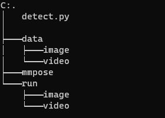

# hit_product

## Khởi tạo môi trường và cài đặt
### Môi trường
- Bước 1
```shell
# Tạo môi trường conda và kích hoạt
$ conda create --name py python=3.8
$ conda activate py
```
- Bước 2
```shell
# cài thư viện Pytorch với (GPU)
$ conda install pytorch torchvision -c pytorch
```

```shell
# cài thư viện Pytorch với (CPU)
$ conda install pytorch torchvision cpuonly -c pytorch
```
### Cài đặt
- Bước 1: cài thư viện MMCV với MIM.
```shell
$ pip install -U openmim
$ mim install mmcv-full
```
- Bước 2: Cài MMpose
```shell
$ pip install mmpose
$ git clone https://github.com/open-mmlab/mmpose.git
$ cd mmpose
$ pip install -r requirements.txt
$ pip install -v -e .
```

## Lưu trữ

### Tổ chức file (tạm thời)

